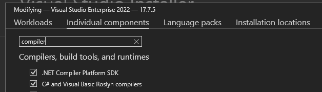

# Contributing to Stryker.NET
This is the contribution guide for Stryker.NET. Great to have you here! Here are a few ways you can help make this project better.

## Creating issues
Do you have an idea for a feature or have you found a bug? Please create an issue so we can talk about it!
If you found a bug, please run ```dotnet stryker --verbosity debug``` and add the output of the Stryker run to the issue.

## Adding new features
New features are welcome! Either as requests or proposals.

1.	Please create an issue first, so we know what to expect from you.
1.	Create a fork on your github account.
1.	When writing your code, please conform to the [Microsoft coding guidelines](https://docs.microsoft.com/en-us/dotnet/csharp/programming-guide/inside-a-program/coding-conventions).
1.	Please create or edit unit tests or integration tests.
1.	Run the tests and verify they pass.
1. Update documentation.

## Adding a new mutator
Please read the [dedicated document](adding_a_mutator.md).

## Setup Stryker.NET locally
While developing on Stryker.NET we advise to work in [the latest Visual Studio](https://www.visualstudio.com/downloads/) and to set Stryker up to run on a UnitTest project on your local disk.

### Example: Steps to run Stryker.NET on a local project
*	Clone the repository `https://github.com/stryker-mutator/stryker-net.git`
*	Open `Stryker.sln`
*	On `Stryker.CLI` open `properties > Debug`
*	Create a new Debug profile
*	Set `Launch` as `Project`
*	Set `WorkingDirectory` as your local installation dir, pointing to a UnitTest project `example: (C:\Repos\MyProject\src\MyProject\MyProject.UnitTest)`. You can use the ready made projects in `.\integrationtest\TargetProjects` for this.
*	Run the program with `Stryker.CLI` as the startup project with the newly created Debug profile

\* Running Stryker on itself doesn't work as the assemblies will be in use by Visual Studio. You can clone Stryker another time to use as a test project.

#### Compiler Platform SDK
We advise to use the `.NET Compiler Platform SDK` during development. The `Syntax Visualizer` can help to understand Abstract Syntax Trees and find out types of `SyntaxNodes` you need to target for certain mutators. The `.NET Compiler Platform SDK` is available as a component in the Visual Studio Installer.


#### Other helpful resources
- [Roslyn Quoter](http://roslynquoter.azurewebsites.net/), for determining SyntaxFactory AST builder methods required to construct a syntax tree for the any C# input.
- [Sharplab](https://sharplab.io/), for visualising different compilation steps of C# (AST, IL etc.) 

## Maintainers
When merging pull requests or creating commits, please conform to [the angular commit message style](https://docs.google.com/document/d/1rk04jEuGfk9kYzfqCuOlPTSJw3hEDZJTBN5E5f1SALo), so our changelog will be updated.
   Namely in the form `<type>(<scope>): <subject>\n\n[body]`
   * Type: feat, fix, docs, style, refactor, test, chore.
   * Scope: the file or group of files (not a strict right or wrong)
   * Subject and body: present tense (~changed~*change*, ~added~*add*) and include motivation and contrasts with previous behavior

## Community
Do you want to help? Great! These are a few things you can do:

* Evangelize mutation testing. Mutation testing is still relatively new, especially in .NET Core. Please help us get the word out there!
* Share your stories in blog posts an on social media. Please inform us about it! Did you use Stryker? Your feedback is very valuable to us. Good and bad! Please contact us and let us know what you think
