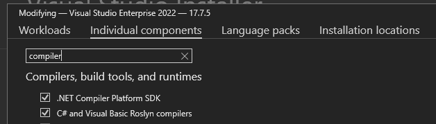

# Contributing to Stryker.NET
This is the contribution guide for Stryker.NET. Great to have you here! Here are a few ways you can help make this project better.

## Creating issues
Do you have an idea for a feature or have you found a bug? Please create an issue so we can talk about it!
When you face an issue you can try using the `--diag` option (```dotnet stryker --diag```) this help you pinpoint the
cause of your problem.
### Diagnosis related options
- L: write all logs in a tex file
- diag: performs supplemental checks and logs additional information to help diagnose issues
- verbosity: controls the amount of detail in the output. The default is `info`, but you can set it to `debug` or
`trace`for more detailed information.

## Pull requests
Please open an issue or a discussion first. PR without a supporting issue or discussion are treated as low priority.
Focus your PR on the problem you are trying to solve.

### Proposing a fix
1. Please open an issue with a clear description of the problem. 
2. Your PR should include an integration test proving the issue is fixed (when possible).

### Adding new features
New features are welcome! Either as requests or proposals.

**Create an issue first, so we know what to expect from you.** And please wait for feedback and oor guidance regarding
how to move forward.

### Operational steps
#### Working on the code
1.	Create a fork on your GitHub account.
1.	When writing your code, please conform to the [Microsoft coding guidelines](https://docs.microsoft.com/en-us/dotnet/csharp/programming-guide/inside-a-program/coding-conventions).
1.	Please create or edit unit tests or integration tests.
1.	Run the tests and verify they pass (including integration tests). 
2.  Update documentation when relevant

#### Submitting your proposal
1. Push your code on GitHub and create a pull request to the main repository.
2. The PR will go through the CI/CD pipeline
3. Ensure the pipeline passes:
    1. Unit tests are green
   2. Integration tests are green
   3. There is no blocking SONAR issues
4. We can help you if you have trouble dealing with test or Sonar issues, please add a comment to the PR and we will help you out.
5. Once the pipeline is green, we will review your PR and provide feedback. 
6. We recommand you try to keep your PR up to date with the main branch, so we can merge it as soon as possible.
Please be patient, we are a small team and have limited time to review PRs.

### Review policy
When reviewing a PR, we concentrate on:
1. The quality of the code, including readability, maintainability, and adherence to coding standards.
2. The quality of the tests, including coverage and effectiveness.
3. The design, to ensure the codebase remains modular and maintainable.
4. The consistency of the PR. A PR should focus on a single issue or feature, and not include unrelated changes.

You should assume the maintainers will request changes or explanations on your PRs, so please be prepared to respond to 
feedback and make necessary adjustments. We appreciate your contributions and want to ensure they meet the project's
standards. 

#### General considerations regarding contributions (PRs and Issues)
- they are triaged and reviewed according to their perceived priority. We use labels to track our decisions
- PRs and issues with no activity for a while will be considered abandoned and may be closed. We usually warn and grant
a grace period before closing one, but this is not guaranteed.
- PRs must be up to date with the main branch before being merged, but it may be done after a PR have been validated by
a maintainer.

#### General considerations regarding LLMs & agents (AI code)
- This project is solely driven by humans. As of today, no agent is involved in maintaining Stryker.Net
- We do not have a strict policy regarding the use of LLMs or agents to generate code
- We hold AI generated/assisted contributions to the same standards as human contributions.
- AI generated/assisted contributions should be labelled as such, for statistical purposes
- Please ensure your AI contributions remain terse and not too verbose. This will slow down integration
- Please take the time to **discuss** with maintainers during review and refrain from using AI for fast turn around on 
feedback. We want to ensure the quality of the codebase and that you understand the code you are contributing.
- AI can act as a multiplier force for abusive behavior, such as pressuring maintainers to address issues/merge PR.
We reserve the right to ban contributors showing such behavior.


## Working locally on Stryker
While developing on Stryker.NET we advise to work in [the latest Visual Studio](https://www.visualstudio.com/downloads/) or [VSCode](https://code.visualstudio.com/Download) and to set Stryker up to run on a project on your local disk.

## Prerequisites
- Ensure you have .NET 10 SDK or later installed

### Visual Studio Setup
Note that you can use alternative IDEs, such as Rider or Visual Studio Code, but we recommand Visual Studio for the time
being.
*	Clone the repository `https://github.com/stryker-mutator/stryker-net.git`
*	Open `Stryker.slnx`
*	On `Stryker.CLI` open `properties > Debug`
*	Create a new Debug profile
*	Set `Launch` as `Project`
*	Set `WorkingDirectory` as your local installation dir, pointing to a UnitTest project `example: (C:\Repos\MyProject\src\MyProject\MyProject.UnitTest)`.
* You can use the ready-made projects in `.\integrationtest\TargetProjects` for this.
*	Run the program with `Stryker.CLI` as the startup project with the newly created Debug profile

### Visual Studio Code Setup
If you prefer using Visual Studio Code instead of Visual Studio, follow these steps to set up Stryker.NET for debugging and testing:

- Open the `stryker-net.code-workspace`
- Install the recommended extensions
- Copy configuration templates:
   - The repository includes example configuration files: `.vscode/launch.json.example` and `.vscode/tasks.json.example`
   - Copy these to `.vscode/launch.json` and `.vscode/tasks.json` respectively:
     ```bash
     cp .vscode/launch.json.example .vscode/launch.json
     cp .vscode/tasks.json.example .vscode/tasks.json
     ```
   - Or manually copy the contents if using Windows

#### About local vs. shared configurations

- The example files (`.example`) are tracked in git and contain shared, tested configurations for all integration test projects
- Your local `launch.json` (created from the example) is **not tracked by git** (it's in `.gitignore`)
- You can safely customize your local `launch.json` with personal test targets without affecting the repository
- To add a new shared configuration for all contributors, update `.vscode/launch.json.example` instead
- The example configurations provide launch targets for:
   - Integration test projects (NetCore and MicrosoftTestPlatform variants)
   - Multiple test frameworks (MSTest, XUnit, NUnit, TUnit)

#### Troubleshooting

- **"Command not found" errors**: Verify `dotnet` is available: run `dotnet --version` in your terminal
   - The tasks.json uses `dotnet` command which works on Windows with .NET SDKs installed globally
   - **On macOS/Linux**: If `dotnet` is not in your PATH when VS Code runs tasks, update the `command` field to the full path:
     - macOS default: `/usr/local/share/dotnet/dotnet`
     - Or use: `which dotnet` in your terminal to find the exact path
   - Alternatively, change `"type": "process"` to `"type": "shell"` to inherit your shell's PATH
- **Breakpoints not working**: Verify you're using Debug configuration (not Release) in the build task

### Running Stryker on Stryker

Running Stryker on itself doesn't work as Stryker will try to write to the assemblies, but they will be in use by Visual Studio (Code).
To run stryker on stryker use the dedicated `stryker on stryker` GitHub action or use the `stryker-on-stryker.ps1` script locally.

For debugging clone Stryker another time to use as a test project locally.

## Adding a new mutator
Please read the [dedicated document](adding_a_mutator.md).

#### Compiler Platform SDK
We advise to use the `.NET Compiler Platform SDK` during development. The `Syntax Visualizer` can help to understand Abstract Syntax Trees and find out types of `SyntaxNodes` you need to target for certain mutators. The `.NET Compiler Platform SDK` is available as a component in the Visual Studio Installer.


#### Other helpful resources
- [Roslyn Quoter](http://roslynquoter.azurewebsites.net/), for determining SyntaxFactory AST builder methods required to construct a syntax tree for the any C# input.
- [Sharplab](https://sharplab.io/), for visualising different compilation steps of C# (AST, IL etc.) 

## Maintainers
When merging pull requests or creating commits, please conform to the [Conventional Commit guidelines](https://github.com/github/awesome-copilot/blob/main/instructions/conventional-commit.prompt.md), so our changelog will be updated.
   Namely in the form `<type>(<scope>): <subject>\n\n[body]`
   * Type: feat, fix, docs, style, refactor, test, chore.
   * Scope: the file or group of files (not a strict right or wrong)
   * Subject and body: present tense (~changed~*change*, ~added~*add*) and include motivation and contrasts with previous behavior

## Community
Do you want to help? Great! These are a few things you can do:

* Evangelize mutation testing. Mutation testing is still relatively new, especially in .NET Core. Please help us get the word out there!
* Share your stories in blog posts an on social media. Please inform us about it! Did you use Stryker? Your feedback is very valuable to us. Good and bad! Please contact us and let us know what you think
