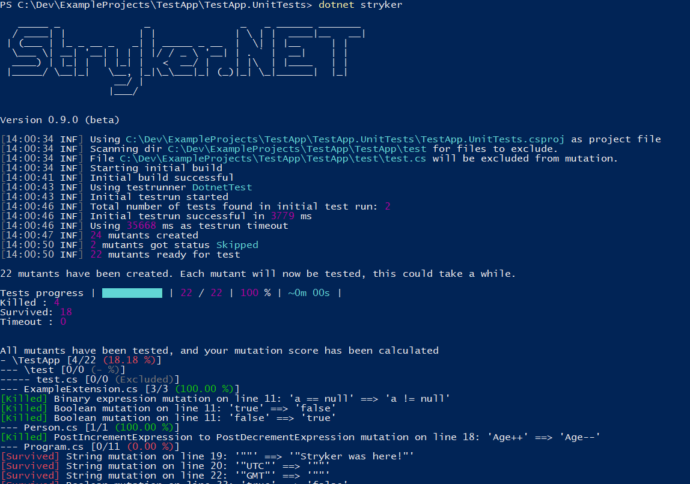

Welcome to the documentation for Stryker for .NET. Also known as Stryker.NET or stryker-net.

### Stryker.NET

Stryker.NET offers you mutation testing for your .NET Core and .NET Framework projects. It allows you to test your tests by temporarily inserting bugs. Stryker.NET is installed using NuGet.

For a full guide on how to configure Stryker.NET see our [configuration guide](./Configuration.md).

Looking for our [mutators](./Mutators.md) or [reporters](./Reporters.md)?
