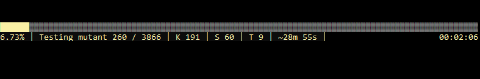

Stryker supports a variety of reporters. Enabled reporters will be activated during and after your Stryker run. 

<!-- TOC -->
- [Html reporter](#html-reporter)
- [Console reporter](#console-reporter)
- [Progress reporter](#progress-reporter)
- [Console dots reporter](#console-dots-reporter)
- [Json reporter](#json-reporter)
<!-- /TOC -->

The default reporters are:

```
dotnet stryker --reporters ["ConsoleReport", "ConsoleProgressBar"]
```

## Html reporter
Our html reporter will output a html file that will visually display your project and all mutations. This is our recomended reporter for larger projects, since it displays large number of mutations in a clear way. 

```
dotnet stryker --reporters ["html"]
```

Example:


## Console reporter
Stryker.NET default report. It displays all mutations right after the mutation testrun is done. Ideal for a quick run, as it leaves no file on your system.

```
dotnet stryker --reporters ["ConsoleReport"]
```

Example:


## Progress reporter
This reporter outputs the current status of the mutation testrun. It has a nice visual look so you can quickly see the progress. We recomend to use this reporter on large projects. It also shows an indication of the estimated time for Stryker.NET to complete.

```
dotnet stryker --reporters ["ConsoleProgressBar"]
```
Example:


## Console dots reporter
A basic reporter do display the progress of the mutationtest run. It indicates very simple how many mutants have been tested and their status. This is ideal to use on build servers, as it has little/no performance loss while still giving insight.

```
dotnet stryker --reporters ["ConsoleProgressDots"]
```
Example:


Where `"."` means killed, `"S"` means survived and `"T"` means timed out.

## Json reporter
This reporter outputs a json file with all mutation testrun info of the last run. The json is also used for the HTML reporter, but using this reporter you could use the file for your own purposes.

```
dotnet stryker --reporters ["Json"]
```