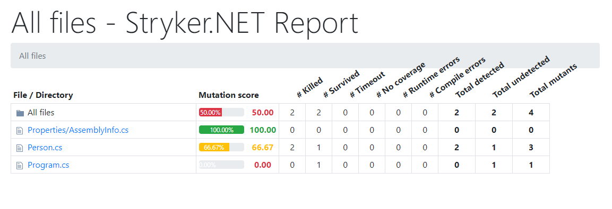
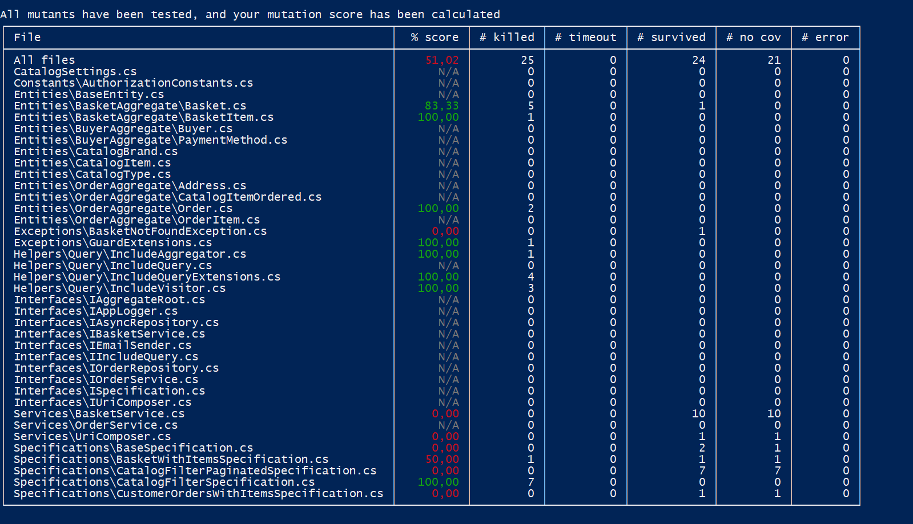
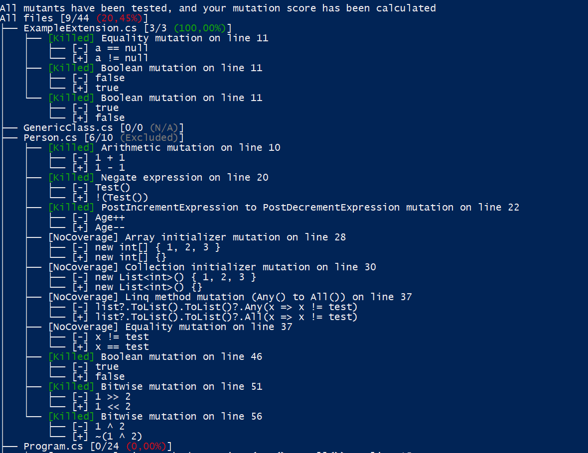

Stryker supports a variety of reporters. Enabled reporters will be activated during and after your Stryker run. 

The default reporters are:

```bash
dotnet stryker --reporters "['html', 'progress']"
```

# Html reporter
Our html reporter will output a html file that will visually display your project and all mutations. This is our recomended reporter for larger projects, since it displays large number of mutations in a clear way. 

```bash
dotnet stryker --reporters "['html']"
```

Example:



# Dashboard reporter
The dashboard reporter will upload your stryker result as json to the [stryker dashboard](https://dashboard.stryker-mutator.io/). To use this reporter some settings should be configured:

```bash
dotnet stryker --reporters "['dashboard']"
```

## Api key
Get your api key at [stryker dashboard](https://dashboard.stryker-mutator.io/). To keep your api key safe, store it in an encrypted variable in your pipeline.

Configure the key using the following option:

```bash
dotnet stryker --dashboard-api-key <key>
```

or by setting the environment variable `STRYKER_DASHBOARD_API_KEY`.


## Project name
The name registered with the dashboard. It is in the form of `gitProvider/organization/repository`. At the moment the dashboard backend only supports github.com as a git provider, but we will also support gitlab.com/bitbucket.org, etc in the future. It can have an indefinite number of levels. Slashes (/) in this name are not escaped. For example `github.com/stryker-mutator/stryker-net`.

```bash
dotnet stryker --dashboard-project <name>
```

## Project version
The version of the report. This should be filled with the branch name, git tag or git sha (although no validation is done). You can override a report of a specific version, like docker tags. Slashes in the version should not be encoded. For example, it's valid to use "feat/logging".

```bash
dotnet stryker --dashboard-version <version>
```

## Project module
Optional. If you want to store multiple reports for a version, you can use this value to separate them logically. For example, in a mono-repo setup where each package (or project or module) delivers a report.

```bash
dotnet stryker --dashboard-module <name>
```

## Configure using file
The dashboard can also be configured using the config file. But keep in mind your api-key should not be pushed to version control. 
```json
{
  "stryker-config": {
    "dashboard-api-key": "xxx",
    "dashboard-project": "xxx",
    "dashboard-version": "test",
    "dashboard-module": "sub",
    "reporters": [
      "dashboard"
    ]
  }
}
```

# Cleartext reporter
It displays all files right after the mutation testrun is done. Ideal for a quick run, as it leaves no file on your system.

```bash
dotnet stryker --reporters "['cleartext']"
```

Example:




# Cleartext tree reporter
It displays all mutations right after the mutation testrun is done. Ideal for a quick run, as it leaves no file on your system. It is recommended to turn this reporter off on big projects.

```bash
dotnet stryker --reporters "['cleartextTree']"
```

Example:




# Progress reporter
This reporter outputs the current status of the mutation testrun. It has a nice visual look so you can quickly see the progress. We recomend to use this reporter on large projects. It also shows an indication of the estimated time for Stryker.NET to complete.

```bash
dotnet stryker --reporters "['progress']"
```

Example:


# Console dots reporter
A basic reporter to display the progress of the mutationtest run. It indicates in a very simple way how many mutants have been tested and their status. This is ideal to use on build servers, as it has little/no performance loss while still giving insight.

```bash
dotnet stryker --reporters "['dots']"
```

Example:


Where `"."` means killed, `"S"` means survived and `"T"` means timed out.

# Json reporter
This reporter outputs a json file with all mutation testrun info of the last run. The json is also used for the HTML reporter, but using this reporter you could use the file for your own purposes.

```bash
dotnet stryker --reporters "['json']"
```
