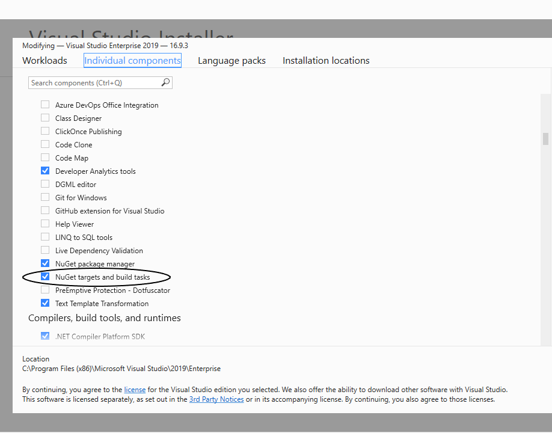

# Install prerequisites

## General

Stryker is installed using the dotnet cli as a [dotnet tool](https://docs.microsoft.com/en-us/dotnet/core/tools/global-tools)

Stryker requires the dotnet 8 runtime or newer: [Install dotnet](https://dotnet.microsoft.com/download)

\* Note: Your application does not need to target dotnet 8 or newer. You only need the runtime installed so stryker can run.

## Dotnet framework specific
Nuget is required for dotnet framework. Follow the instructions at [Install nuget](https://docs.microsoft.com/en-us/nuget/install-nuget-client-tools#windows) including adding nuget to the path. Otherwise stryker will not be able to find and use nuget.

Make sure NuGet targets and build tasks are installed. You can install them with visual studio by going to Tools > Get Tools and Features > Individual components > Code tools



## Migrating

Coming from an older version of Stryker.NET? Take a look at our [migration guide](https://stryker-mutator.io/docs/stryker-net/migration-guide).

# Install stryker

Stryker can be installed globally for your whole system or locally for a specific project.

## Install globally
```bash
dotnet tool install -g dotnet-stryker
```

## Install in project
Create a file called dotnet-tools.json in your project folder if this is your first local tool.

```bash
dotnet new tool-manifest
```

Then install stryker without the -g flag by executing the following command in the project folder

```bash
dotnet tool install dotnet-stryker
```

Check the `dotnet-tools.json` file into source control

Now the rest of your team can install or update stryker with the following command:

```bash
dotnet tool restore
```

# Prepare

Make sure the working directory for your console is set to the *unit test* project dir.

# Let's kill some mutants
For most projects no configuration is needed. Simply run stryker and it will find your source project to mutate.

```bash
dotnet stryker
```

If more configuration is needed follow the instructions in your console.

# Configure

Optionally you can add a config file to store your options so they won't have to be passed using CLI each run.

Do this by adding a `stryker-config.json` file to your run location. Now add your config to the file like this:

```
{
    "stryker-config":
    {
        "reporters": [
            "progress",
            "html"
        ]
    }
}
```

For all available configuration see [our configuration page](https://stryker-mutator.io/docs/stryker-net/Configuration).

# Troubleshooting
Have troubles running Stryker? Try running with trace logging.

```bash
dotnet stryker --verbosity trace --log-to-file
```

Please [report any issues](http://github.com/stryker-mutator/stryker-net/issues) you have or let us know [via Slack](https://join.slack.com/t/stryker-mutator/shared_invite/enQtOTUyMTYyNTg1NDQ0LTU4ODNmZDlmN2I3MmEyMTVhYjZlYmJkOThlNTY3NTM1M2QxYmM5YTM3ODQxYmJjY2YyYzllM2RkMmM1NjNjZjM).
