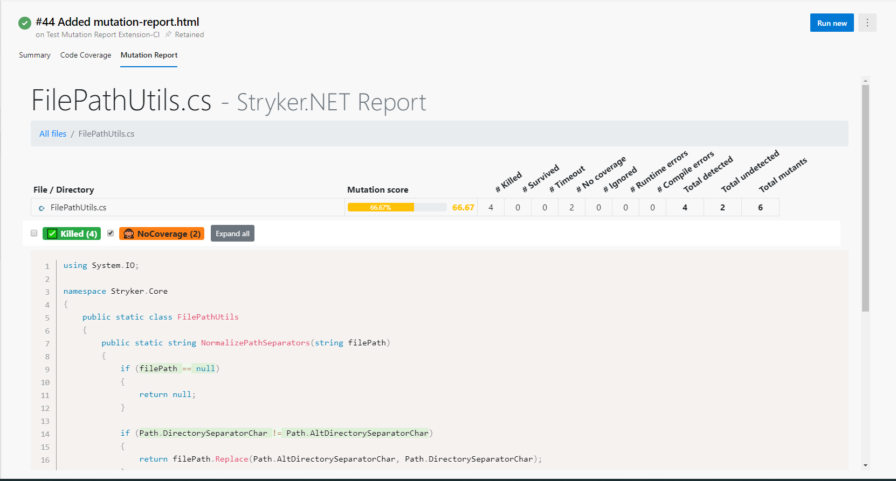

When running stryker in your pipeline there are some things to take into consideration

## Installing stryker in a pipeline

Due to the way dotnet core global tools are installed on the system a regular `dotnet tool install -g` is often not effective in pipelines.

Instead use the `--tool-path` to install stryker in a local folder or use the project level install of dotnet core 3.0+

Example for installing in azure devops:

```yaml
- task: DotNetCoreCLI@2
    displayName: 'Install dotnet-stryker'
    inputs:
      command: custom
      custom: tool
      arguments: install dotnet-stryker --tool-path $(Agent.BuildDirectory)/tools
```

And then running this locally installed tool:

```yaml
- task: Powershell@2
    displayName: 'Run dotnet-stryker'
    inputs:
      workingDirectory: <test-project-folder-here>
      targetType: 'inline'
      pwsh: true
      script: $(Agent.BuildDirectory)/tools/dotnet-stryker
```

## Require a minimum mutation score in your pipeline

Configure a break threshold to make sure your pipeline fails when the mutation score is below a certain level.

```
dotnet stryker --break-at 80
```

## Configuring baseline in pull requests

Dashboard compare is very useful when running stryker in pipelines because it cuts down on the total runtime by only testing mutations that have changed compared to for example master
The following minimal steps are needed to use dashboard compare

1. Enable --with-baseline and choose the comparison target
1. Choose a storage provider (Dashboard for public projects or Azure File Share for private projects)
1. Set up authentication for the chosen storage provider 
1. Set --version to the name of the source branch (usually current branch)
1. Set any other options needed for your chosen storage provider (see: [storage provider docs](https://stryker-mutator.io/docs/stryker-net/configuration#baselineprovider-string))

Example for azure devops with dashboard storage provider:
```
dotnet stryker --with-baseline:$(System.PullRequest.TargetBranch) --dashboard-api-key $(Stryker.Dashboard.Api.Key) --version $(System.PullRequest.SourceBranch)
```

```json
{
  "stryker-config": {
    "baseline": {
      "provider": "Dashboard"
    }
  }
}
```

## Azure DevOps Extensions

There are multiple Azure DevOps extensions to enrich the Stryker experience. 

### Mutation Report Publisher

With this extension you add the mutation report to your build summary so you can view the mutation test result on azure devops.

In YAML pipelines add the following after the test step:

```yaml
- task: PublishMutationReport@1
  displayName: 'Publish Mutation Test Report'
  inputs:
    reportPattern: '**/mutation-report.html'
```

You now get a new tab on your build pipeline where you can click through the complete mutation testing report generated by your mutation test run. When using Stryker the [mutation testing report](https://github.com/stryker-mutator/mutation-testing-elements) looks like:



To install 'Mutation Report Publisher' or for more information go to the [marketplace](https://marketplace.visualstudio.com/items?itemName=stryker-mutator.mutation-report-publisher).
