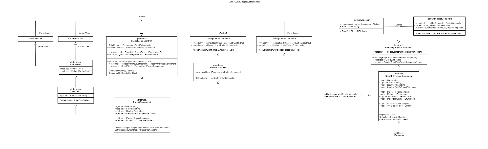

Stryker.NET uses custom classes to keep track of folders and files. These classes are based on the composite pattern.

These FolderComposite and FileLeafs have readonly variants, this is done to ensure the mutated source code and Mutants are not changed after the mutation is placed.

### UML of the classes in the namespace Stryker.Core.ProjectComponents


### Old Design
The global structure was as follows: 
* ```FolderComposite```
* ```FileLeaf```

With the abstract class they both implement:
* ```ProjectComponent```

### New Design
When implementing F# the old structure showed it's disadvantages since F# uses a different type to indicate syntax trees.

To solve this ```ProjectComponent``` was made generic ```ProjectComponent<T>```.

However many parts of stryker use ```FolderComposite``` and ```FileLeaf``` without needing access to the syntax trees or to know what language is used.
For this purpose the Interface IProjectComponent is used.

```IFolderComposite``` and ```IFileLeaf``` are implemented for the same reason. 
This enables code to ask for an ```IFileLeaf``` so It can access the elements that do not depend on the language, that being all except the syntax trees.

For applications that do need access to the syntax trees ```ProjectComponent<T>``` can be used or the specific type, being:
* ```CsharpFolderComposite```
* ```CsharpFileLeaf```

OR
* ```FsharpFolderComposite```
* ```FsharpFileLeaf```

```IFileLeaf<T>``` is needed to have language agnostic notation for the syntax trees.


### ReadOnly variants
Not al code is created equally, and not all parts of stryker need write access to the ProjectComponents.
This is why a IReadOnlyProjectComponent was created.

When expanding into F# we found the implementation lacking and expanded upon it.
There are ReadOnly variants of ```FolderComponent``` and ```FileLeaf```:
* ```ReadOnlyFolderComponent```
* ```ReadOnlyFileLeaf```

The readonly variants do not need access to the syntax trees so they are language agnostic which improves the expandability of Stryker.NET

The variant of ```FolderComponent``` and ```FileLeaf``` all contain the functions ```ToReadOnly()``` and ```ToReadOnlyInputComponent()```.

```ToReadOnly()``` returns the ReadOnly variant of said type. ```ToReadOnlyInputComponent()``` does the same, just casted to ```IReadOnlyProjectComponent```.

```ToReadOnly()``` takes the interfaces ```IParentComponent``` and ```IFileLeaf``` as input so the readonly variants do not need to distinguish between ```CsharpFileLeaf``` and FsharpFileLeaf for example. 

##### Note
```FolderComponent``` and ```FileLeaf``` are NOT classes that exist in Stryker.NET only the language specific implementations exist!
